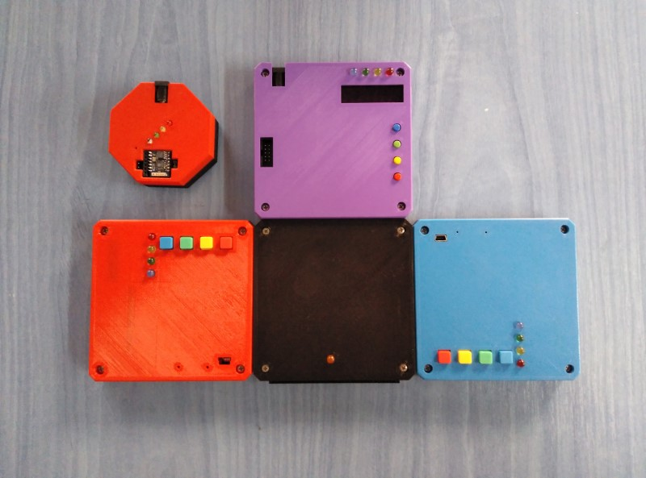

# LudiComputer
An easy way to build own personal computers, in an 80 pin, 2mm pitch, in my own S80 based bus

It is an electronic unit built by the player himself

It is not just about playing, but also, above all, about building systemic computing machines embedded within minimum agreements.

In practice and as objectives, LudiComputers are: 
fantastic calculators, 
fun computers, 
chaotic computers, 
relaxed workstations, 
robotics that make humans work 
and in general systems where the important thing is to have been the designer and/or builder of the game machine itself.

The S80 Bus

The LudiComputers with S80 base connector are units that communicate with each other through one or more central bases, called nexus.
The nexus are electrically neutral, without power and havent only an LED that indicates the presence of energy on the bus supplied by one of the participants in the game. 
This topology modifies the classic connection form of the nexus, which instead of being on a battery, can form a flat extended structure on the game board, like domino tiles.

